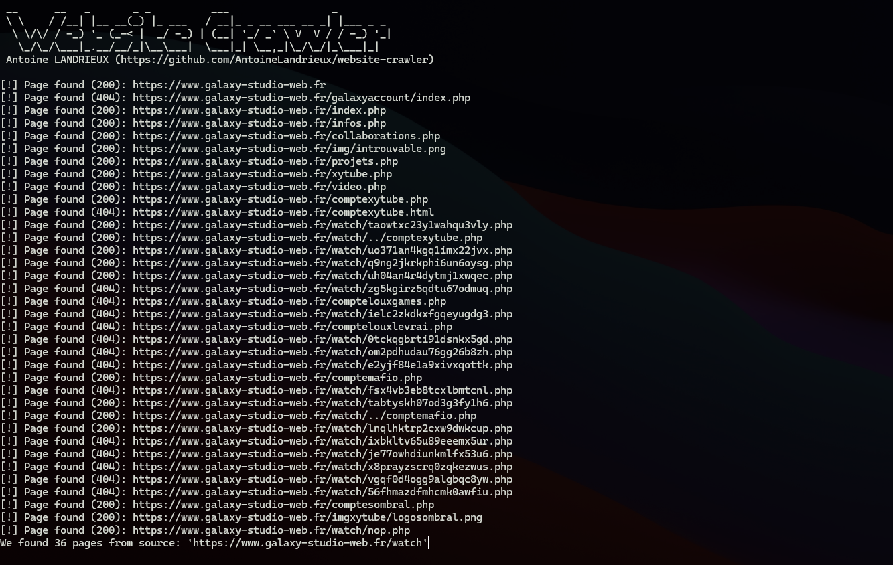

# Website Crawler

Allows you to see all visible files on a website, ignoring the `robots.txt` file

> [!NOTE]
> `crawler.py` require yaml:
> `pip install pyyaml`

## Credit

- [Antoine Landrieux](https://github.com/AntoineLandrieux) - Developer
